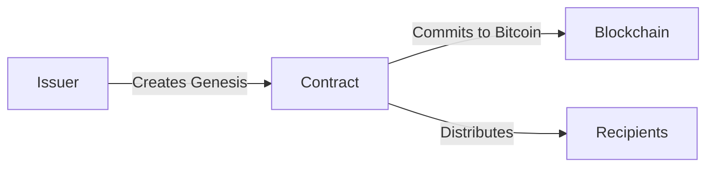
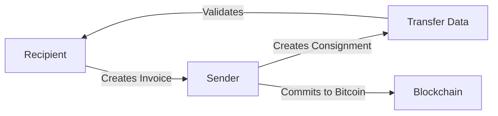

# Core Concepts Overview

RGB is built on revolutionary distributed computing concepts that enable smart contracts on Bitcoin without modifying the blockchain itself. This section introduces the core architectural principles.

## The RGB Paradigm

RGB fundamentally reverses traditional blockchain validation through three key concepts:

### 1. Client-Side Validation

Unlike traditional blockchains where every node validates every transaction, RGB uses **client-side validation**:

- Only parties involved in a transaction validate its history
- Validation data is transferred off-chain via consignments
- Bitcoin blockchain contains only cryptographic commitments
- Privacy is preserved as others can't see your transactions

[Learn more about Client-Side Validation →](/core-concepts/client-side-validation)

### 2. Single-Use Seals

RGB prevents double-spending by leveraging **Bitcoin's UTXO model** - using what RGB calls "single-use seals":

- Each RGB state is bound to a Bitcoin UTXO
- Spending the UTXO = "closing the seal"
- Bitcoin consensus prevents double-spending the UTXO
- Therefore: RGB state cannot be double-spent
- No RGB-specific consensus required (Bitcoin does it)

[Learn more about Single-Use Seals →](/core-concepts/single-use-seals)

### 3. PRISM Computing

RGB implements **Partially-Replicated Infinite State Machines** (PRISM):

- Not all participants replicate the entire state
- Each party maintains only their relevant state fragment
- State evolves as a directed acyclic graph (DAG)
- Enables massive scalability

[Learn more about PRISM Computing →](/core-concepts/prism-computing)

## RGB Architecture Layers

```
┌─────────────────────────────────────────┐
│  Contractum Smart Contract Language     │  High-level contract definition
├─────────────────────────────────────────┤
│  RGB Schema & Interfaces                │  Contract templates & APIs
│  (RGB20, RGB21, RGB22, ...)             │
├─────────────────────────────────────────┤
│  zk-AluVM Virtual Machine               │  Contract execution & validation
│  (40 instructions, non-von-Neumann)     │
├─────────────────────────────────────────┤
│  Client-Side Validation                 │  State validation logic
│  (Consignments, State Transitions)      │
├─────────────────────────────────────────┤
│  Single-Use Seals                       │  Ownership & double-spend prevention
│  (Bitcoin UTXOs)                        │
├─────────────────────────────────────────┤
│  Deterministic Bitcoin Commitments      │  Commitment layer
│  (Tapret, Opret, MPC)                   │
├─────────────────────────────────────────┤
│  Bitcoin & Lightning Network            │  Settlement & publication layer
└─────────────────────────────────────────┘
```

## Key Components

### AluVM Virtual Machine

RGB uses **zk-AluVM**, a revolutionary VM designed for zk-STARK compatibility:

- **40 instructions** total (vs thousands in traditional VMs)
- **Non-von-Neumann** architecture
- **Read-once memory** compatible with single-use seals
- **Turing-complete** despite simplicity
- **Formally verifiable** code analysis

[Explore AluVM →](/core-concepts/aluvm/overview)

### State Management

RGB v0.12 unified all state into a single type of finite field elements:

- **Owned State**: Rights controlled by Bitcoin script
- **Global State**: Public information accessible to all
- **Metadata**: Additional contract-specific data

[Learn about State Management →](/core-concepts/state/unified-state)

### Bitcoin Integration

RGB leverages Bitcoin through deterministic commitments:

- **Tapret**: Taproot-based commitments (preferred)
- **Opret**: OP_RETURN-based commitments (fallback)
- **MPC**: Multi-Protocol Commitments for efficiency

[Understand Bitcoin Integration →](/core-concepts/bitcoin/deterministic-commitments)

## Data Flow

### Contract Issuance



### Asset Transfer



## Design Principles

### Privacy by Design

- Original transaction details are never published
- Only cryptographic hashes visible on-chain
- State distributed only to relevant parties
- Optional blinding for UTXO allocations

### Scalability

- Validation complexity grows with personal history, not global state
- Parallel validation across different assets
- No blockchain bloat from smart contract execution
- Lightning Network integration for instant transfers

### Simplicity

RGB v0.12 achieved dramatic simplification:

- **4x reduction** in codebase size
- **Single unified state type**
- **40-instruction VM**
- Easier to audit and verify

### Bitcoin-Native

- No altcoins or separate consensus
- Leverages Bitcoin's security
- Compatible with Lightning Network
- Uses existing Bitcoin primitives

## RGB vs Traditional Smart Contracts

| Aspect | Traditional (Ethereum) | RGB |
|--------|----------------------|-----|
| Validation | Global (all nodes) | Client-side (parties only) |
| State Storage | On-chain (public) | Off-chain (private) |
| Privacy | Minimal | Strong |
| Scalability | Limited | Massive |
| Fees | Variable, often high | Bitcoin TX fees only |
| Execution | On-chain | Off-chain |
| Blockchain | Purpose-built | Bitcoin |

## Understanding RGB Through Use Cases

### Fungible Tokens (RGB20)

```
Issue stablecoins, securities, utility tokens
↓
Transfer instantly on Lightning
↓
Maintain complete privacy
↓
Pay only Bitcoin transaction fees
```

### Non-Fungible Tokens (RGB21)

```
Create unique digital assets
↓
Attach rich metadata
↓
Transfer ownership via Bitcoin
↓
Prove authenticity through validation
```

### Complex Contracts

```
Write in Contractum language
↓
Compile to AluVM bytecode
↓
Execute validation logic
↓
Enforce rules via single-use seals
```

## zk-STARK Future

RGB v0.12 was designed for future zk-STARK integration:

```
Current: ~100 lines of validation code
↓
Future: Single zk-STARK proof
↓
Result: Constant-size validation
+ Ultimate privacy
+ Instant verification
```

## Key Takeaways

1. **Client-side validation** keeps data off-chain and private
2. **Single-use seals** prevent double-spending without global consensus
3. **PRISM computing** enables massive scalability
4. **AluVM** provides Turing-complete contract execution
5. **Bitcoin-native** design leverages existing security
6. **zk-ready** architecture prepares for zero-knowledge future

## Next Steps

Dive deeper into specific concepts:

- [**Client-Side Validation**](/core-concepts/client-side-validation) - How RGB validates without blockchain
- [**Single-Use Seals**](/core-concepts/single-use-seals) - Preventing double-spending
- [**AluVM**](/core-concepts/aluvm/overview) - The RGB virtual machine
- [**State Management**](/core-concepts/state/unified-state) - How RGB manages state
- [**Bitcoin Integration**](/core-concepts/bitcoin/deterministic-commitments) - RGB's Bitcoin layer

## Additional Resources

- [RGB Blueprint](https://rgb-org.github.io/) - Comprehensive technical specification
- [RGB FAQ](https://www.rgbfaq.com) - Common questions answered
- [Academic Papers](https://rgb.tech/research) - Research publications
