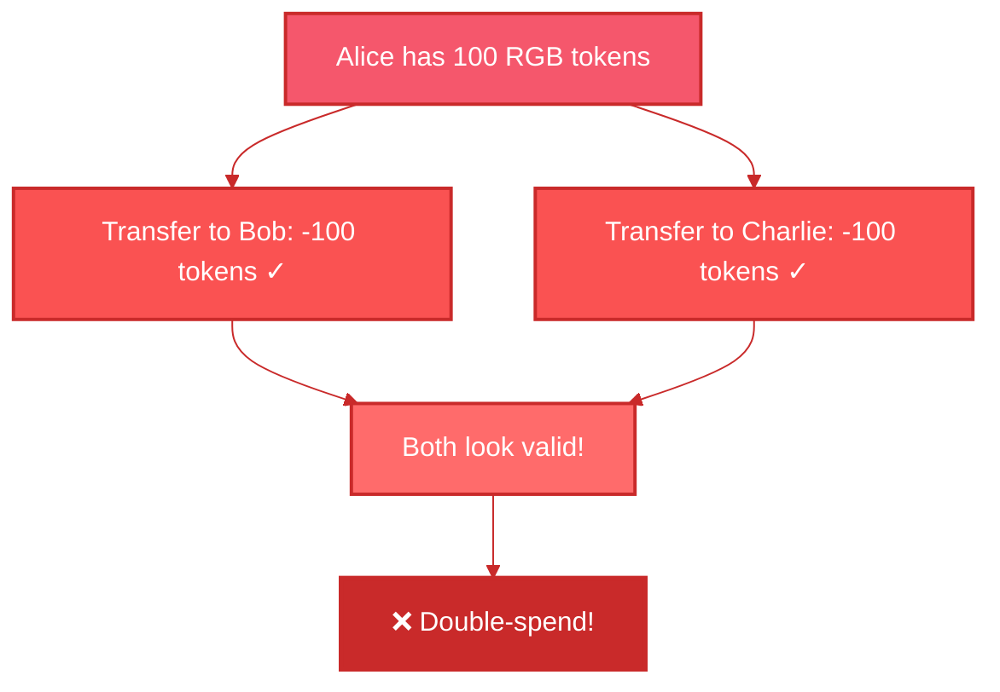
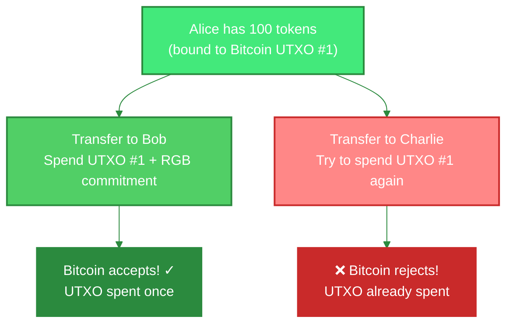
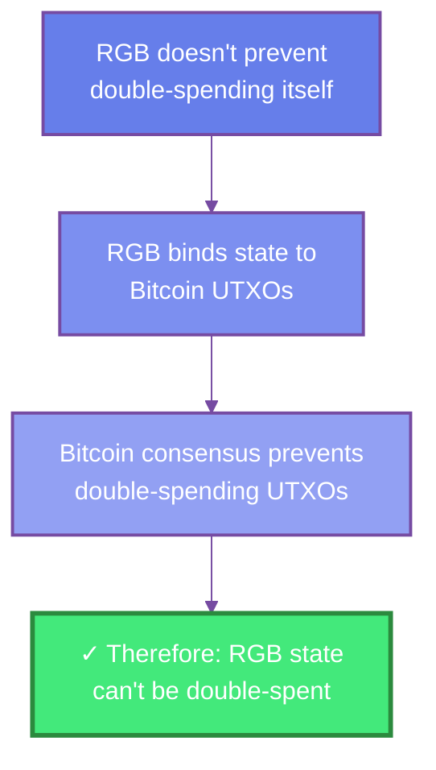

# Single-Use Seals

Single-use seals are a **conceptual framework** for understanding how RGB prevents double-spending by leveraging Bitcoin's existing UTXO model. They're not a new cryptographic primitive, but rather an **abstraction** that describes how RGB uses the fundamental property that Bitcoin UTXOs can only be spent once.

## What is a Single-Use Seal?

A single-use seal is an **abstraction over Bitcoin's UTXO model** that provides a conceptual framework for three key operations:

:::info What Single-Use Seals Really Are
Single-use seals are **not a new cryptographic primitive**. They're simply a way of describing how RGB uses Bitcoin's existing UTXO properties for state management. When Bitcoin prevents you from spending the same UTXO twice, RGB calls this a "single-use seal."
:::

### 1. Seal Definition (Abstraction)

In Bitcoin terms: **A UTXO that exists**
In RGB terms: A "seal" that can be closed once

```
Seal = Reference to a Bitcoin UTXO
```

### 2. Seal Closing (Abstraction)

In Bitcoin terms: **Spending the UTXO**
In RGB terms: "Closing the seal" with a state commitment

```
Close(seal) = Spend the UTXO + Embed RGB commitment
```

### 3. Seal Verification (Abstraction)

In Bitcoin terms: **Bitcoin consensus validates the spend**
In RGB terms: "Verifying the seal closure"

```
Verify(seal) = Check UTXO was spent via Bitcoin consensus
```

## Key Property: Single-Use

This abstraction leverages Bitcoin's fundamental property: **a UTXO can only be spent once**.

```
UTXO spent once → CONFIRMED by Bitcoin network
Try to spend again → REJECTED by Bitcoin consensus
```

RGB doesn't create this property - it **uses the existing UTXO model** as a mechanism for state commitment.

## The Abstraction: Bitcoin UTXOs AS Seals

RGB maps Bitcoin's UTXO model to the seal abstraction:

```
Bitcoin Reality          RGB Abstraction
───────────────────     ─────────────────
UTXO                 →  Seal Definition
Spending the UTXO    →  Seal Closing
Bitcoin consensus    →  Seal Verification
Can't double-spend   →  Can't reuse seal
```

**Important**: Single-use seals aren't a new invention - they're a **design pattern** for thinking about how RGB leverages Bitcoin's existing properties.

### Example

```rust
// Define a seal (point to a UTXO)
let seal = Seal {
    txid: "abc123...",
    vout: 0,
    method: SealMethod::Tapret
};

// Close the seal (spend the UTXO)
let closure = close_seal(
    seal,
    new_state_commitment,  // The message
    bitcoin_tx             // The witness
);

// Verify the seal closure
verify_seal_closure(seal, closure)?; // ✓ Valid
```

## How RGB Uses Bitcoin's Double-Spend Prevention

### The Problem (Without Bitcoin)



### The Solution (Using Bitcoin UTXOs)

RGB binds state to Bitcoin UTXOs, so **Bitcoin's existing double-spend prevention** protects RGB state:



### Bitcoin Does the Heavy Lifting



**Key Insight**: RGB gets double-spend prevention "for free" by using Bitcoin's UTXO model. The "single-use seal" terminology is just a way to describe this property.

## Seal Methods in RGB

RGB v0.12 supports two seal closing methods:

### 1. Tapret (Taproot-based)

**Preferred method** using Taproot script path:

```
Commitment placed in taproot leaf
├── Better privacy
├── Smaller blockchain footprint
└── Requires taproot wallet
```

```rust
let seal = Seal::tapret(txid, vout);
```

### 2. Opret (OP_RETURN-based)

**Fallback method** for non-taproot wallets:

```
Commitment in OP_RETURN output
├── Works with legacy wallets
├── Visible on chain
└── Slightly larger footprint
```

```rust
let seal = Seal::opret(txid, vout);
```

## Seal Lifecycle

### 1. Creation

```rust
// Genesis creates initial seals
let genesis_seal = Seal::tapret(
    genesis_txid,
    allocation_vout
);

// State is sealed to UTXO
let state = SealedState {
    seal: genesis_seal,
    amount: 1000,
};
```

### 2. Transition

```rust
// Input: Old seal (being closed)
let old_seal = previous_allocation.seal;

// Output: New seal (being created)
let new_seal = Seal::tapret(
    transition_txid,
    recipient_vout
);

// Transition closes old, creates new
let transition = StateTransition {
    inputs: vec![old_seal],
    outputs: vec![new_seal],
};
```

### 3. Verification

```rust
// Verify seal was actually closed
fn verify_seal_closed(seal: &Seal) -> Result<()> {
    // Check UTXO is spent
    let utxo = get_utxo(&seal.txid, seal.vout)?;

    ensure!(
        utxo.is_spent(),
        "Seal not closed: UTXO still unspent"
    );

    Ok(())
}
```

## Advanced Concepts

### Blinded Seals

Seals can be "blinded" for privacy:

```rust
// Recipient creates blinded seal
let blinded_seal = create_blinded_seal(
    secret_key,
    utxo_commitment
);

// Sender can't see actual UTXO
// But can still close the seal correctly
```

### Seal Witnesses

Bitcoin transactions serve as witnesses:

```rust
struct SealWitness {
    // Bitcoin transaction that spent the UTXO
    bitcoin_tx: Transaction,

    // Merkle proof of inclusion
    merkle_proof: MerkleProof,

    // Block header
    block_header: BlockHeader,
}
```

### Multi-Protocol Commitments (MPC)

Multiple seals can share one Bitcoin commitment:

```
One Bitcoin TX commits to:
├── RGB seal closure #1 (Token A transfer)
├── RGB seal closure #2 (NFT transfer)
└── RGB seal closure #3 (Token B transfer)
    └── Efficient batching!
```

## Seals vs Traditional Consensus

| Aspect | Traditional Blockchain | RGB Single-Use Seals |
|--------|----------------------|----------------------|
| Validation | Global consensus | Individual verification |
| Double-Spend Prevention | All nodes validate | Bitcoin enforces |
| Privacy | Public | Private |
| Scalability | Limited | Unlimited |
| Validation Cost | O(network size) | O(1) per seal |

## Security Model

### Assumptions

1. **Bitcoin is secure**: UTXOs can only be spent once
2. **Cryptographic hashes are collision-resistant**: Can't forge commitments
3. **Recipients validate**: Must check seals are properly closed

### Threat Model

#### ✓ Protected Against

- Double-spending (Bitcoin prevents)
- State forgery (cryptographic commitments)
- History rewriting (Bitcoin immutability)

#### ❌ NOT Protected Against

- Recipients not validating (user error)
- Spending unconfirmed UTXOs (wait for confirmation)
- Bitcoin 51% attack (same as Bitcoin)

## Implementation Examples

### Creating a Seal

```rust
use rgb::Seal;

// Create tapret seal
let seal = Seal::new_tapret(
    OutPoint::new(txid, vout)
);

// Or create opret seal
let seal = Seal::new_opret(
    OutPoint::new(txid, vout)
);
```

### Closing a Seal

```rust
// Create state transition
let transition = create_transition(
    inputs: vec![old_seal],
    outputs: vec![new_seal],
    state_data: transfer_data,
);

// Commit to Bitcoin
let commitment = create_commitment(&transition);

// Create Bitcoin transaction
let bitcoin_tx = create_bitcoin_tx(
    spend_utxo(old_seal.outpoint()),
    commit_to(commitment),
    new_utxo(new_seal.outpoint()),
);

// Broadcast Bitcoin transaction
broadcast(bitcoin_tx)?;
```

### Verifying a Seal

```rust
fn verify_seal_closure(
    seal: &Seal,
    witness: &SealWitness,
    commitment: &Commitment,
) -> Result<()> {
    // 1. Verify UTXO was spent
    verify_utxo_spent(seal, witness)?;

    // 2. Verify commitment in transaction
    verify_commitment_present(witness.tx, commitment)?;

    // 3. Verify transaction is confirmed
    verify_confirmation(witness)?;

    Ok(())
}
```

## Common Patterns

### Batch Seal Closures

```rust
// Close multiple seals in one Bitcoin TX
let batch_closure = BatchSealClosure {
    seals: vec![seal1, seal2, seal3],
    commitments: vec![comm1, comm2, comm3],
    witness: single_bitcoin_tx,
};
```

### Conditional Seals

```rust
// Seal that can only be closed under certain conditions
let conditional_seal = ConditionalSeal {
    seal: base_seal,
    condition: AluVMScript::new(validation_logic),
};
```

### Time-Locked Seals

```rust
// Seal that can't be closed before block height
let timelock_seal = TimeLockSeal {
    seal: base_seal,
    unlock_height: 800000,
};
```

## Best Practices

### For Developers

```rust
// ✓ GOOD: Wait for confirmation
async fn safe_seal_closure() {
    let tx = broadcast_seal_closure()?;
    wait_for_confirmations(tx, 6).await?;
    mark_seal_closed();
}

// ✗ BAD: Trust unconfirmed
fn unsafe_seal_closure() {
    broadcast_seal_closure()?;
    // Don't wait!
    mark_seal_closed(); // Risky!
}
```

### For Users

```
1. ✓ Always wait for Bitcoin confirmations (6+ blocks)
2. ✓ Verify seal closures in consignments
3. ✓ Keep UTXO private keys secure
4. ✗ Don't reuse sealed UTXOs for other purposes
```

## Debugging

### Check Seal Status

```bash
# Using RGB CLI
rgb seal status <TXID>:<VOUT>

# Output:
# Status: Closed
# Closed in: <CLOSE_TXID>
# Block: 800123
# Confirmations: 45
```

### Verify Seal Closure

```bash
# Verify a seal was properly closed
rgb seal verify \
  --seal <TXID>:<VOUT> \
  --witness <WITNESS_FILE>

# Output: ✓ Valid seal closure
```

## Next Steps

- [**PRISM Computing**](/core-concepts/prism-computing) - How seals fit into the computing model
- [**State Management**](/core-concepts/state/unified-state) - How state is bound to seals
- [**Bitcoin Integration**](/core-concepts/bitcoin/deterministic-commitments) - How seals commit to Bitcoin

## Additional Resources

- [Single-Use Seals Paper](https://petertodd.org/2016/commitments-and-single-use-seals)
- [RGB Seals Specification](https://rgb-org.github.io/)
- [Implementation](https://github.com/RGB-WG/rgb-core/tree/master/src/seals)
