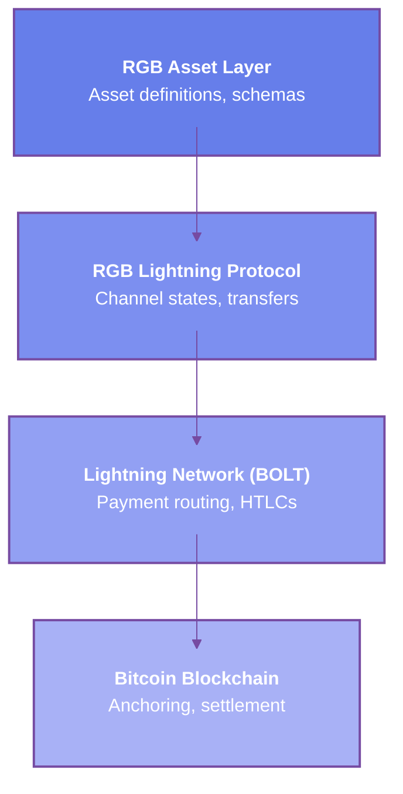

# RGB Lightning Overview

RGB Lightning enables instant, low-cost transfer of RGB assets through Lightning Network channels. This integration combines RGB's client-side validation with Lightning's payment channel technology for scalable, private asset transfers.

## What is RGB Lightning?

RGB Lightning extends the Lightning Network to support RGB assets alongside Bitcoin. Users can open channels, route payments, and transfer tokens with the same speed and privacy as Lightning Bitcoin payments.

### Key Features

- **Instant Transfers**: RGB asset transfers confirmed in milliseconds
- **Low Fees**: Minimal routing fees compared to on-chain transfers
- **Privacy**: Onion-routed payments hide sender and recipient
- **Atomic Swaps**: Exchange RGB assets for Bitcoin or other RGB assets
- **Scalability**: Millions of transactions without Bitcoin blockchain congestion

*Feature details to be expanded*

## How It Works

### RGB-Enabled Channels

Lightning channels are modified to track both Bitcoin and RGB asset balances:

```
Standard Lightning Channel:
Alice: 500,000 sats
Bob:   500,000 sats

RGB-Enabled Channel:
Alice: 500,000 sats + 1000 RGB tokens
Bob:   500,000 sats + 0 RGB tokens
```

*Channel structure to be expanded*

### Channel State Updates

Each Lightning commitment transaction includes RGB state:

```typescript
interface ChannelState {
  // Bitcoin balances
  bitcoin: {
    alice: 500000n,
    bob: 500000n
  },

  // RGB asset balances
  rgb_assets: [
    {
      contract_id: 'rgb:...',
      alice: 1000n,
      bob: 0n
    }
  ],

  // Commitment number
  commitment_number: 42,

  // RGB state commitments
  rgb_commitments: [
    {
      contract: 'rgb:...',
      state_hash: '0x...',
      proof: merkle_proof
    }
  ]
}
```

*State structure to be expanded*

### Payment Flow

1. **Invoice Creation**: Recipient creates RGB Lightning invoice
2. **Route Discovery**: Find path through RGB-enabled nodes
3. **HTLC Setup**: Create hash time-locked contracts for each hop
4. **Asset Transfer**: Update RGB state in each channel
5. **Settlement**: Reveal preimage to claim payment

*Payment workflow to be expanded*

## Architecture

### Protocol Layers



*Architecture details to be expanded*

### Component Integration

**RGB Node**: Validates asset states and transitions
**Lightning Node**: Manages channels and routes payments
**Bitcoin Node**: Monitors blockchain and broadcasts transactions
**Consignment Storage**: Stores RGB proofs for validation

*Component roles to be expanded*

## Setting Up RGB Lightning

### Prerequisites

```bash
# Install RGB node
cargo install rgb-node

# Install RGB-enabled Lightning (LNP/BP)
cargo install lnp-node

# Install Bitcoin Core
apt install bitcoind
```

*Installation to be expanded*

### Node Configuration

```yaml
# rgb-lightning.conf
network: bitcoin

rgb:
  enabled: true
  stash_dir: ~/.rgb/stash
  contracts: [rgb20, rgb21]

lightning:
  node_alias: "RGB-LN-Node"
  listen: 0.0.0.0:9735
  rgb_channels: true

bitcoin:
  rpc_url: http://localhost:8332
  rpc_user: user
  rpc_password: pass
```

*Configuration to be expanded*

### Starting RGB Lightning Node

```bash
# Start RGB daemon
rgbd --config rgb.conf

# Start Lightning daemon with RGB support
lnpd --config lightning.conf --rgb-enabled

# Verify RGB support
lnp-cli getinfo
```

Output:
```json
{
  "node_id": "03abc...",
  "rgb_enabled": true,
  "rgb_contracts": ["rgb:schema:fungible:..."],
  "channels": 5,
  "rgb_channels": 2
}
```

*Node setup to be expanded*

## Opening RGB Channels

### Creating RGB-Enabled Channel

```bash
# Open channel with RGB asset allocation
lnp-cli openchannel \
  --peer 03def... \
  --amount 1000000 \
  --rgb-asset rgb:2wHxKf... \
  --rgb-amount 5000
```

*Channel opening to be expanded*

### Channel Funding

```typescript
import { RgbLightning } from '@rgbjs/lightning';

const lightning = new RgbLightning(config);

// Open channel with Bitcoin and RGB assets
const channel = await lightning.openChannel({
  peer: peerNodeId,

  // Bitcoin funding
  bitcoinAmount: 1000000n,  // sats

  // RGB asset funding
  rgbAssets: [
    {
      contractId: 'rgb:...',
      amount: 5000n,
      seal: myUtxo
    }
  ],

  feeRate: 5
});

console.log('Channel opened:', channel.channelId);
```

*Funding process to be expanded*

## Making RGB Payments

### Creating Invoice

```bash
# Create RGB Lightning invoice
lnp-cli addinvoice \
  --amount-rgb 100 \
  --contract-id rgb:2wHxKf... \
  --description "Payment for services"
```

```typescript
const invoice = await lightning.createInvoice({
  assetId: 'rgb:...',
  amount: 100n,
  description: 'Payment for services',
  expiry: 3600
});

console.log('Invoice:', invoice.toString());
// lnrgb:2wHxKf...
```

*Invoice creation to be expanded*

### Sending Payment

```bash
# Pay RGB Lightning invoice
lnp-cli payinvoice lnrgb:2wHxKf...
```

```typescript
const payment = await lightning.payInvoice(invoice);

console.log('Payment hash:', payment.paymentHash);
console.log('Preimage:', payment.preimage);
console.log('Amount:', payment.amount);
console.log('Fees:', payment.fees);
```

*Payment sending to be expanded*

## Benefits and Trade-offs

### Advantages

- **Speed**: Millisecond confirmations vs minutes/hours on-chain
- **Cost**: Routing fees much lower than on-chain fees
- **Privacy**: No public blockchain record
- **Scalability**: Unlimited transaction throughput
- **Finality**: Instant settlement within channels

*Benefits to be expanded*

### Limitations

- **Liquidity**: Requires funded channels
- **Online Requirement**: Both parties must be online
- **Channel Management**: Need to open/close channels
- **Routing**: Finding paths for RGB assets more complex
- **Backup Complexity**: Must backup channel states

*Limitations to be expanded*

## Use Cases

### Micropayments

Enable tiny payments infeasible on-chain:

*To be expanded*

### Streaming Payments

Continuous payment flows:

*To be expanded*

### Instant Settlement

Real-time exchange and trading:

*To be expanded*

### Cross-Border Transfers

Fast international asset transfers:

*To be expanded*

## Security Considerations

### Channel Security

- Monitor channel state
- Maintain watchtowers
- Backup channel data
- Use appropriate channel capacity

*Security practices to be expanded*

### Asset Validation

- Verify RGB proofs in channels
- Validate state transitions
- Check contract authenticity
- Monitor for fraud attempts

*Validation procedures to be expanded*

## Network Topology

### RGB-Enabled Nodes

Not all Lightning nodes support RGB:

```bash
# Find RGB-capable nodes
lnp-cli listnodes --rgb-only

# Connect to RGB node
lnp-cli connect \
  --node-id 03abc... \
  --rgb-contracts rgb:2wHxKf...
```

*Network discovery to be expanded*

### Liquidity Pools

Specialized nodes providing RGB liquidity:

*To be expanded*

## Monitoring and Management

### Channel Status

```bash
# List RGB channels
lnp-cli listchannels --rgb

# Check RGB balances
lnp-cli rgbbalance --contract-id rgb:2wHxKf...
```

```typescript
const channels = await lightning.listChannels();

channels.forEach(channel => {
  console.log(`Channel ${channel.id}:`);
  console.log(`  Bitcoin: ${channel.localBalance} sats`);

  channel.rgbAssets.forEach(asset => {
    console.log(`  ${asset.ticker}: ${asset.localBalance}`);
  });
});
```

*Monitoring tools to be expanded*

### Rebalancing

Optimize channel liquidity:

*To be expanded*

## Future Developments

### Planned Features

- **Multi-asset channels**: Support multiple RGB assets per channel
- **Atomic swaps**: Built-in asset exchange
- **Submarine swaps**: On-chain ↔ Lightning swaps
- **Watchtowers**: RGB-aware monitoring services
- **Mobile clients**: Lightweight RGB Lightning wallets

*Roadmap to be expanded*

### Research Areas

- **Channel factories**: Improved channel creation
- **Eltoo integration**: Simplified channel updates
- **PTLCs**: Privacy-enhanced transfers
- **Trampoline routing**: Better mobile support

*Research directions to be expanded*

## Related Documentation

- [Asset Channels](./asset-channels.md)
- [Routing](./routing.md)
- [RGB20 Transfers](../rgb20/transferring-assets.md)
- [Lightning Integration](../../technical-reference/lightning.md)
- [Channel Management](../../technical-reference/channels.md)
